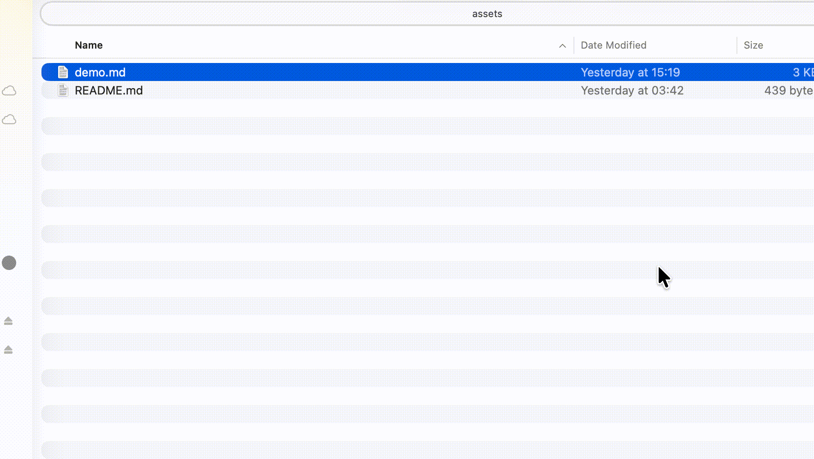

# FluxMarkdown

[中文 README](README_ZH.md)

Beautiful Markdown previews in macOS QuickLook (Mermaid, KaTeX, GFM, TOC).

> Inspired by and partially based on [markdown-preview-enhanced](https://github.com/shd101wyy/markdown-preview-enhanced).

---

## Demo

> TODO: record `docs/assets/demo.gif` (10 15s). See `docs/assets/README.md`.



---

## Install (30 seconds)

### Homebrew (Recommended)

```bash
brew tap xykong/tap
brew install --cask flux-markdown
```

### Manual (DMG)

1. Download the latest `FluxMarkdown.dmg` from [Releases](https://github.com/xykong/flux-markdown/releases)
2. Open the DMG
3. Drag **FluxMarkdown.app** to **Applications**

---

## Why FluxMarkdown

- **GFM**: tables, task lists, strikethrough
- **Mermaid** diagrams
- **KaTeX** math
- **Code highlighting**
- **TOC panel** with section tracking
- **Zoom** (Cmd +/-/0, Cmd+scroll, pinch)
- **Scroll position memory** per file
- **Links**: full navigation in the main app; QuickLook shows a toast due to sandbox limitations

---

## Troubleshooting

### "App is damaged" / "Unidentified developer"

```bash
xattr -cr "/Applications/FluxMarkdown.app"
```

### QuickLook not refreshing

```bash
qlmanage -r
```

More: see `docs/` (start with `docs/TROUBLESHOOTING.md` and `docs/AUTO_UPDATE.md`).

---

## Comparison (QuickLook Markdown plugins)

| Feature | FluxMarkdown | [QLMarkdown](https://github.com/sbarex/QLMarkdown) | [qlmarkdown](https://github.com/whomwah/qlmarkdown) | [PreviewMarkdown](https://github.com/smittytone/PreviewMarkdown) |
| --- | --- | --- | --- | --- |
| Install | brew cask / DMG | brew cask / DMG | manual | App Store / DMG |
| Mermaid | Yes | Yes ([ref](https://github.com/sbarex/QLMarkdown/blob/main/README.md#mermaid-diagrams)) | Not mentioned | Not mentioned |
| KaTeX / Math | Yes | Yes ([ref](https://github.com/sbarex/QLMarkdown/blob/main/README.md#mathematical-expressions)) | Not mentioned | Not mentioned |
| GFM | Yes | Yes (cmark-gfm; [ref](https://github.com/sbarex/QLMarkdown/releases/tag/1.0.18)) | Partial (Discount; [ref](https://github.com/whomwah/qlmarkdown#introduction)) | Not mentioned |
| TOC panel | Yes | Not mentioned | No | Not mentioned |
| Themes | Light/Dark/System | CSS-based ([ref](https://github.com/sbarex/QLMarkdown/blob/main/README.md#extensions)) | Not mentioned | Basic controls ([ref](https://github.com/smittytone/PreviewMarkdown#adjusting-the-preview)) |
| Zoom | Yes | Not mentioned | No | Not mentioned |
| Scroll restore | Yes | Not mentioned | No | Not mentioned |

> Notes:
> - Entries are based on public README/release notes at the cited links.
> - If a feature isn't mentioned in sources, we mark it as "Not mentioned".

---

## Build from source

```bash
git clone https://github.com/xykong/flux-markdown.git
cd flux-markdown
make install
```

## License

See `LICENSE`.
