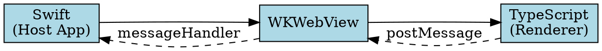
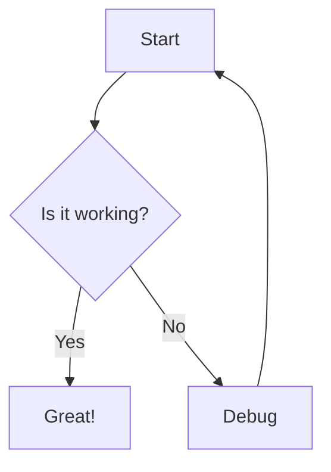

# Feature Validation

This document tests all 9 new features added to FluxMarkdown.

## 1. YAML Front Matter

The YAML block above should be rendered as a styled table at the top of the page.

## 2. GitHub Alerts / Callouts

> [!NOTE]
> This is a **note** callout. It should have a blue left border and note icon.

> [!TIP]
> This is a **tip** callout. It should have a green left border.

> [!IMPORTANT]
> This is an **important** callout. It should have a purple left border.

> [!WARNING]
> This is a **warning** callout. It should have a yellow/orange left border.

> [!CAUTION]
> This is a **caution** callout. It should have a red left border.

> Regular blockquote (no callout type) — should render as normal blockquote.

## 3. Extended Code Highlighting

```scala
object HelloWorld extends App {
  println("Hello, Scala!")
  val nums = List(1, 2, 3).map(_ * 2)
}
```

```kotlin
fun main() {
    val greeting = "Hello, Kotlin!"
    println(greeting)
}
```

```rust
fn main() {
    let msg = String::from("Hello, Rust!");
    println!("{}", msg);
}
```

```r
df <- data.frame(x = 1:5, y = c(2.3, 4.1, 3.5, 5.2, 4.8))
plot(df$x, df$y, type = "l", main = "R Plot")
```

```haskell
main :: IO ()
main = do
  let xs = [1..10] :: [Int]
  print $ map (*2) xs
```

```elixir
defmodule Hello do
  def greet(name), do: "Hello, #{name}!"
end
IO.puts Hello.greet("Elixir")
```

```toml
[package]
name = "my-project"
version = "0.1.0"

[dependencies]
serde = { version = "1.0", features = ["derive"] }
```

```graphql
query GetUser($id: ID!) {
  user(id: $id) {
    name
    email
    posts {
      title
    }
  }
}
```

## 4. Vega-Lite Diagram

```vega-lite
{
  "$schema": "https://vega.github.io/schema/vega-lite/v5.json",
  "description": "A simple bar chart",
  "data": {
    "values": [
      {"category": "A", "value": 28},
      {"category": "B", "value": 55},
      {"category": "C", "value": 43},
      {"category": "D", "value": 91},
      {"category": "E", "value": 81}
    ]
  },
  "mark": "bar",
  "encoding": {
    "x": {"field": "category", "type": "nominal"},
    "y": {"field": "value", "type": "quantitative"}
  }
}
```

## 5. Graphviz Diagram



## 6. Export HTML / PDF

> The export functionality is triggered via the File menu in the macOS app.
> - **Cmd+Shift+E** → Export as HTML
> - **Cmd+Shift+P** → Export as PDF

## 7. Settings UI

> Settings are accessible via **Cmd+,** in the macOS app.
> Available settings:
> - Theme (Light / Dark / System)
> - Base font size
> - Code highlight theme
> - Enable/disable Mermaid, KaTeX, Emoji

## 8. File Format Support

The extension now supports these additional formats:
- `.mdx` — MDX (Markdown + JSX)
- `.rmd` — R Markdown
- `.qmd` — Quarto
- `.mdoc` — Markdoc
- `.mkd` / `.mkdn` / `.mkdown` — Alternate Markdown extensions

## 9. Math (KaTeX)

Inline math: $E = mc^2$

Display math:

$$
\int_{-\infty}^{\infty} e^{-x^2} dx = \sqrt{\pi}
$$

## Mermaid Diagram (existing feature)


