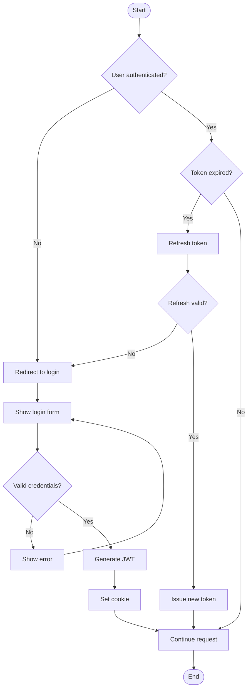
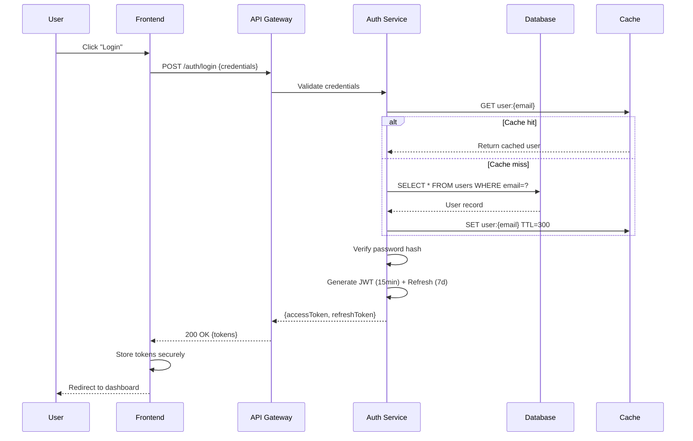
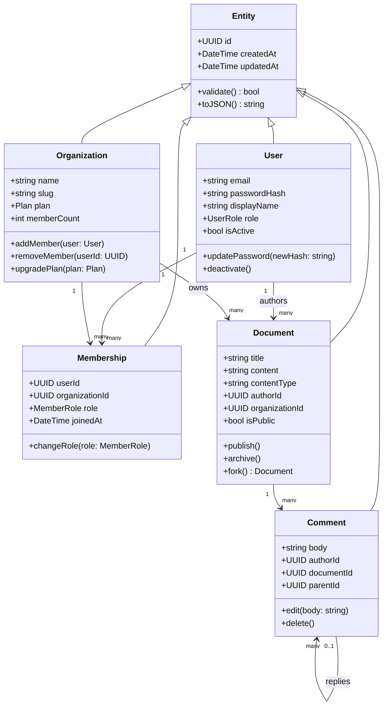
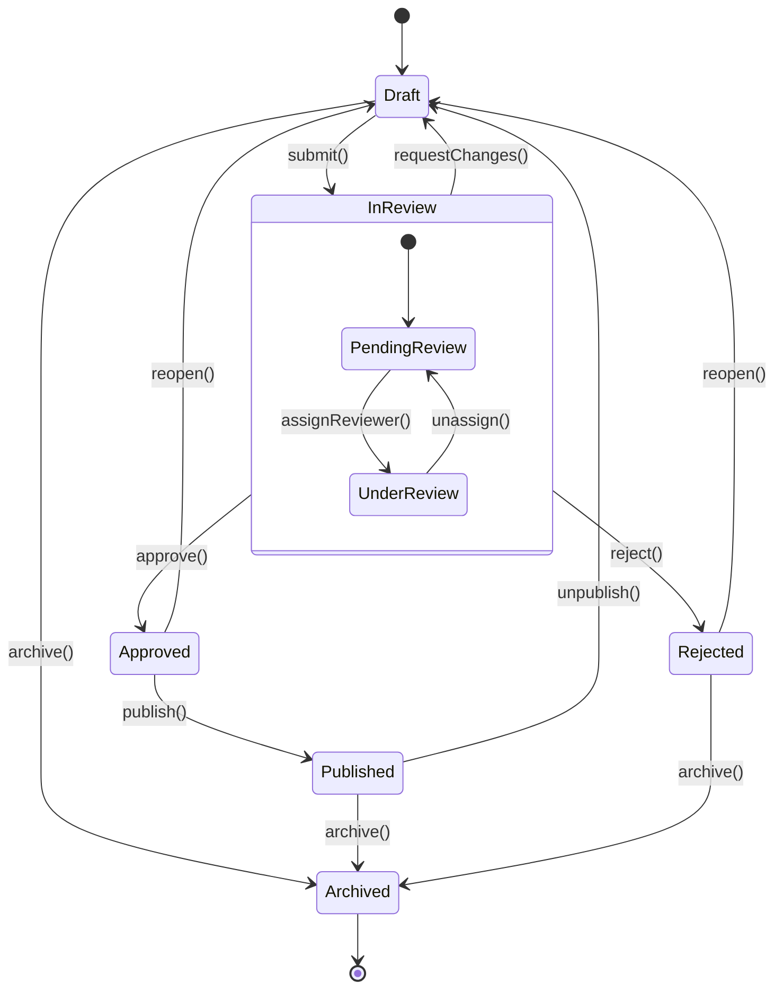
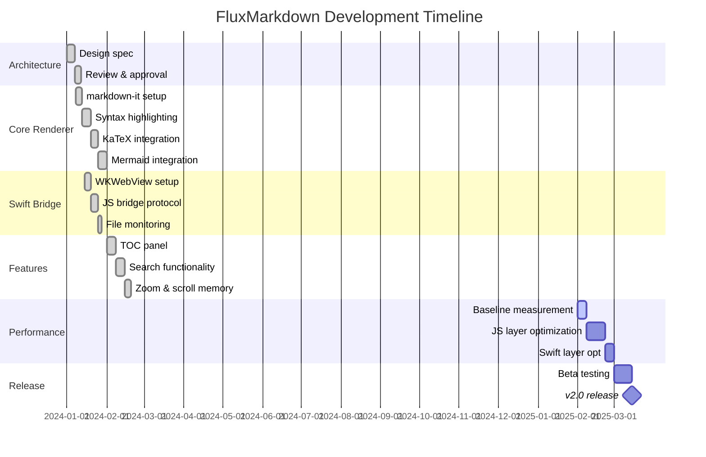
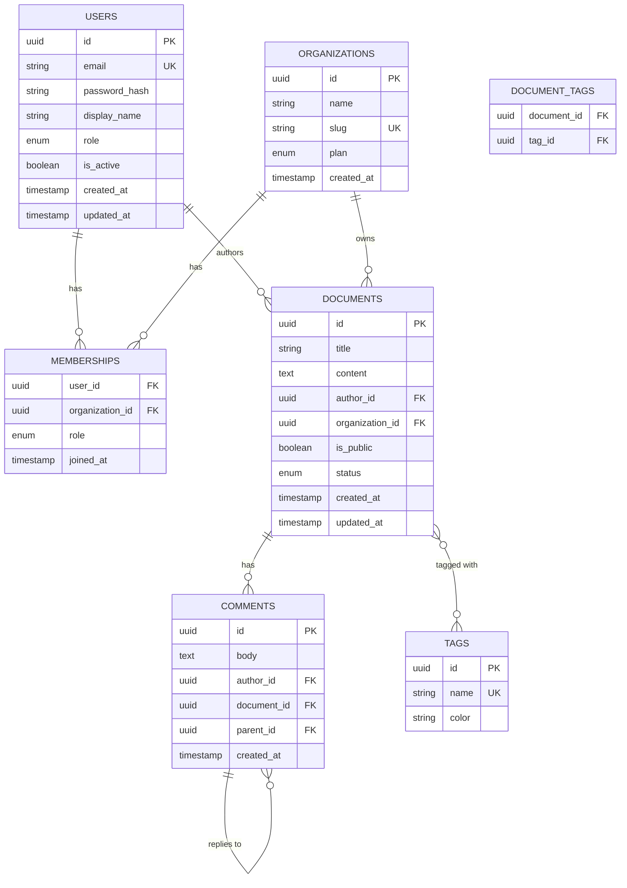
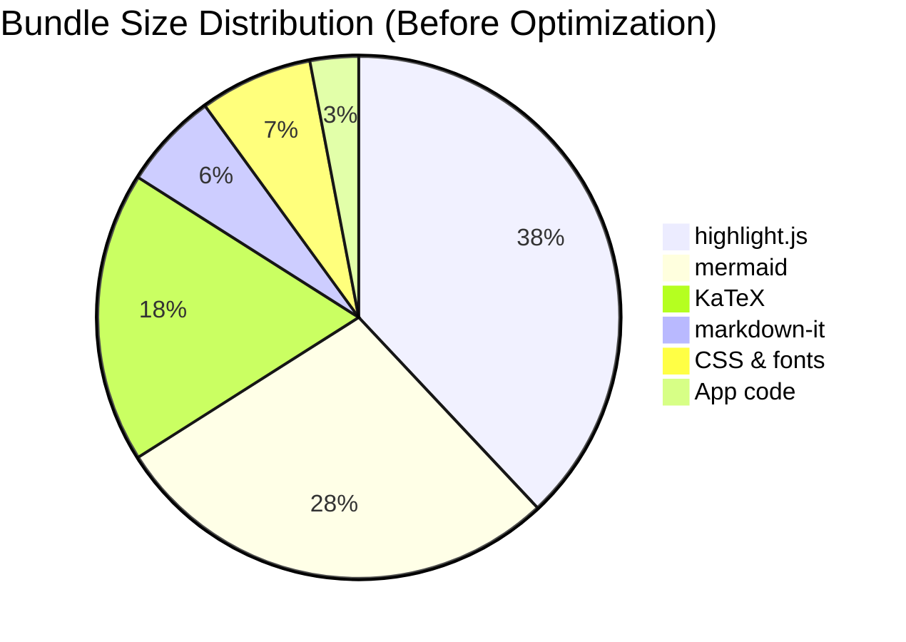
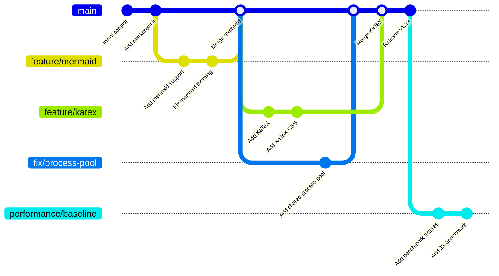

# Mermaid Diagrams (~20KB)

Tests Mermaid rendering performance. Each diagram requires async dynamic import
of the mermaid library and individual render calls.

## Flowchart

## Sequence Diagram

## Class Diagram

## State Diagram

## Gantt Chart

## Entity Relationship Diagram

## Pie Chart

## Git Graph

