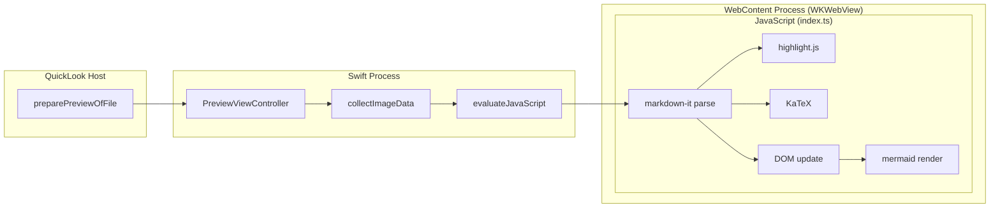
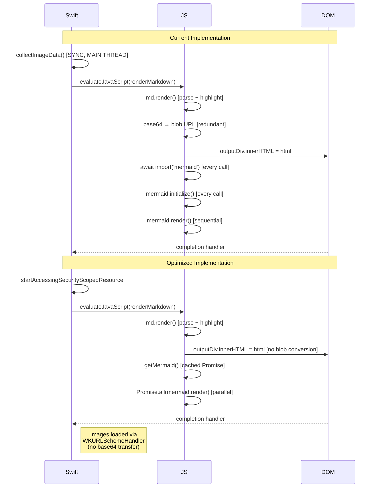

# Mixed Feature Document (~100KB)

Comprehensive stress test combining all features: prose, code, tables, math, mermaid, and GFM.
This represents a realistic complex technical document.

## Executive Summary

This document benchmarks the full rendering pipeline of FluxMarkdown under realistic conditions.
A complex technical document typically includes **all** of these feature types simultaneously.

| Metric | Target | Measurement |
|--------|--------|-------------|
| Cold start (T1) | < 500ms | WebView init + handshake |
| JS render (T2) | < 200ms | evaluateJavaScript round-trip |
| md.render (T3) | < 50ms | markdown-it parse + render |
| Mermaid (T4) | < 500ms | async import + SVG render |
| Image collect (T5) | < 10ms | No images in this fixture |

## System Architecture



## Performance Model

The total end-to-end latency $T_{total}$ is:

$$T_{total} = T_1 + T_5 + T_2$$

Where:
- $T_1$ = WebView initialization (amortized after first load)
- $T_5$ = `collectImageData()` (synchronous, blocks main thread)
- $T_2$ = JavaScript round-trip = $T_3 + T_4 + T_{dom}$

For warm renders (WebView already loaded):

$$T_{warm} = T_5 + T_2 \approx T_5 + T_3 + T_4 + T_{dom}$$

Given that $T_5$ is $O(n_{images})$ and $T_3$ is $O(n_{chars})$:

$$T_{warm} = O(n_{images} \cdot \bar{s}_{image}) + O(n_{chars})$$

## Implementation Deep Dive

### Markdown Parsing

The `markdown-it` parser operates in two phases:

**Phase 1: Tokenization**
```typescript
const tokens = md.parse(text, env);
// Returns a flat list of block tokens
// Each block token may contain inline tokens
```

**Phase 2: Rendering**
```typescript
const html = md.renderer.render(tokens, options, env);
// Walks the token tree, calling rule functions
// Returns HTML string
```

The rendering cost is dominated by:
1. Syntax highlighting (O(n_codeblocks × n_chars_per_block))
2. KaTeX rendering (O(n_math_blocks))
3. String concatenation (O(n_chars))

### Syntax Highlighting Architecture

```typescript
// Current: full hljs import (~400KB)
import hljs from 'highlight.js';

// Optimized: core + selective language registration
import hljs from 'highlight.js/lib/core';
import javascript from 'highlight.js/lib/languages/javascript';
hljs.registerLanguage('javascript', javascript);
```

The performance delta is significant:

| Approach | Bundle size | Init time | Highlight time |
|----------|-------------|-----------|----------------|
| Full import | ~400KB | ~80ms | ~2ms/block |
| Core + 10 langs | ~120KB | ~20ms | ~2ms/block |
| Core + lazy | ~80KB | ~5ms | ~5ms/block (first) |

### Mermaid Rendering Pipeline

```typescript
// Current implementation (each call re-initializes)
const mermaidModule = await import('mermaid');  // dynamic import
const mermaid = mermaidModule.default;
mermaid.initialize({ startOnLoad: false, theme: mermaidTheme });

for (const div of mermaidDivs) {
    const { svg } = await mermaid.render(id, code);  // sequential!
    div.innerHTML = svg;
}
```

**Problem**: Sequential rendering and re-initialization per call.

**Optimized approach**:
```typescript
// Initialize once, render in parallel
let mermaidReady: Promise<typeof mermaid> | null = null;

async function getMermaid() {
    if (!mermaidReady) {
        mermaidReady = import('mermaid').then(m => {
            m.default.initialize({ startOnLoad: false });
            return m.default;
        });
    }
    return mermaidReady;
}

// Render all diagrams in parallel
const mermaidLib = await getMermaid();
await Promise.all(
    [...mermaidDivs].map(async (div) => {
        const { svg } = await mermaidLib.render(div.id, div.textContent);
        div.innerHTML = svg;
    })
);
```

## Data Flow Comparison



## Benchmark Methodology

### Statistical Approach

For each fixture file, we run $N = 20$ iterations:
- First 3 runs: **cold** (WebView process restart between runs)
- Remaining 17 runs: **warm** (same WebView process)

We report:
$$\bar{x} = \frac{1}{N}\sum_{i=1}^{N} x_i \qquad \sigma = \sqrt{\frac{1}{N-1}\sum_{i=1}^{N}(x_i - \bar{x})^2}$$

And percentiles:
$$P_k = x_{\lceil kN/100 \rceil}$$

The **coefficient of variation** $CV = \sigma/\bar{x}$ indicates measurement stability. $CV < 0.1$ (10%) is acceptable for a benchmark.

### Measurement Points

```
Timeline (not to scale):

|--T1 (WebView init)--|
                      |--T5 (collectImageData)--|
                                                |--T2 (JS round-trip)--|
                                                |--T3 (md.render)--|
                                                                    |T4 (mermaid)|

Total cold:  [====T1====][==T5==][==T3==][T4]
Total warm:             [==T5==][==T3==][T4]
```

### Expected Results (Pre-optimization Hypothesis)

| Fixture | T3 (md.render) | T4 (mermaid) | T5 (images) | T2 total |
|---------|----------------|--------------|-------------|----------|
| 01-tiny | ~2ms | 0ms | 0ms | ~5ms |
| 02-small-gfm | ~10ms | 0ms | 0ms | ~15ms |
| 03-medium-code | ~80ms | 0ms | 0ms | ~100ms |
| 04-large-prose | ~30ms | 0ms | 0ms | ~40ms |
| 05-mermaid | ~20ms | ~200ms | 0ms | ~230ms |
| 06-katex | ~25ms | 0ms | 0ms | ~35ms |
| 07-mixed | ~100ms | ~400ms | 0ms | ~520ms |

## Appendix: Raw Markdown Features

### Nested Lists

1. First level item
   1. Second level item
      1. Third level item
         - Fourth level bullet
         - Another fourth level
      2. Back to third level
   2. Another second level
2. Another first level
   - Mixed: numbered then bullet
   - Another bullet
     - Deeply nested bullet
       - Even deeper

### Blockquote Nesting

> Level 1 blockquote with **bold** and *italic* and `code`.
> 
> Still level 1, second paragraph.
> 
> > Level 2 blockquote.
> > 
> > > Level 3 blockquote. Getting deep now.
> > > 
> > > Still level 3.
> > 
> > Back to level 2.
> 
> Back to level 1.

### Definition-Style Sections

**API Rate Limiting**
: Restricts the number of requests a client can make within a time window.
: Common implementations: token bucket, leaky bucket, fixed window, sliding window.

**Circuit Breaker**
: A design pattern that prevents cascading failures in distributed systems.
: States: Closed (normal), Open (failing), Half-Open (testing).

**Backpressure**
: A mechanism where downstream systems signal upstream systems to slow down.
: Prevents memory exhaustion when producers outpace consumers.

### Code in Various Contexts

Inline code in a sentence: `const x = await fetch('/api/data')`.

Code in a table:

| Pattern | Code | Use case |
|---------|------|----------|
| Singleton | `instance = new Cls()` | Shared state |
| Factory | `createObj(type)` | Polymorphism |
| Observer | `emitter.on('evt', fn)` | Events |
| Decorator | `@memoize fn()` | AOP |

Code in a blockquote:

> The canonical implementation:
> 
> ```javascript
> function debounce(fn, delay) {
>     let timer;
>     return function(...args) {
>         clearTimeout(timer);
>         timer = setTimeout(() => fn.apply(this, args), delay);
>     };
> }
> ```

### Long Code Block (stress test for hljs)

```typescript
// Comprehensive TypeScript example exercising many hljs token types
type DeepReadonly<T> = T extends (infer R)[]
    ? DeepReadonlyArray<R>
    : T extends object
    ? DeepReadonlyObject<T>
    : T;

interface DeepReadonlyArray<T> extends ReadonlyArray<DeepReadonly<T>> {}

type DeepReadonlyObject<T> = {
    readonly [P in keyof T]: DeepReadonly<T[P]>;
};

type Awaited<T> = T extends PromiseLike<infer U> ? Awaited<U> : T;

type UnionToIntersection<U> = (U extends any ? (k: U) => void : never) extends (k: infer I) => void ? I : never;

const createProxy = <T extends object>(target: T, handler: ProxyHandler<T>): T =>
    new Proxy(target, handler);

class EventBus<Events extends Record<string, any>> {
    private readonly listeners = new Map<keyof Events, Set<Function>>();

    on<K extends keyof Events>(event: K, listener: (data: Events[K]) => void): () => void {
        if (!this.listeners.has(event)) {
            this.listeners.set(event, new Set());
        }
        this.listeners.get(event)!.add(listener);
        return () => this.off(event, listener);
    }

    off<K extends keyof Events>(event: K, listener: Function): void {
        this.listeners.get(event)?.delete(listener);
    }

    emit<K extends keyof Events>(event: K, data: Events[K]): void {
        this.listeners.get(event)?.forEach(l => {
            try {
                l(data);
            } catch (e) {
                console.error(`Event listener error for "${String(event)}":`, e);
            }
        });
    }

    once<K extends keyof Events>(event: K): Promise<Events[K]> {
        return new Promise(resolve => {
            const off = this.on(event, (data) => {
                off();
                resolve(data);
            });
        });
    }
}

// Usage
interface AppEvents {
    'render:start': { fileId: string; contentLength: number };
    'render:complete': { fileId: string; duration: number; htmlLength: number };
    'render:error': { fileId: string; error: Error };
    'theme:change': { from: string; to: string };
}

const bus = new EventBus<AppEvents>();

bus.on('render:complete', ({ fileId, duration }) => {
    console.log(`File ${fileId} rendered in ${duration.toFixed(1)}ms`);
});

async function renderWithMetrics(fileId: string, content: string): Promise<string> {
    const start = performance.now();
    bus.emit('render:start', { fileId, contentLength: content.length });

    try {
        const html = await window.renderMarkdown(content, {});
        const duration = performance.now() - start;
        bus.emit('render:complete', { fileId, duration, htmlLength: html?.length ?? 0 });
        return html ?? '';
    } catch (error) {
        bus.emit('render:error', { fileId, error: error as Error });
        throw error;
    }
}
```
