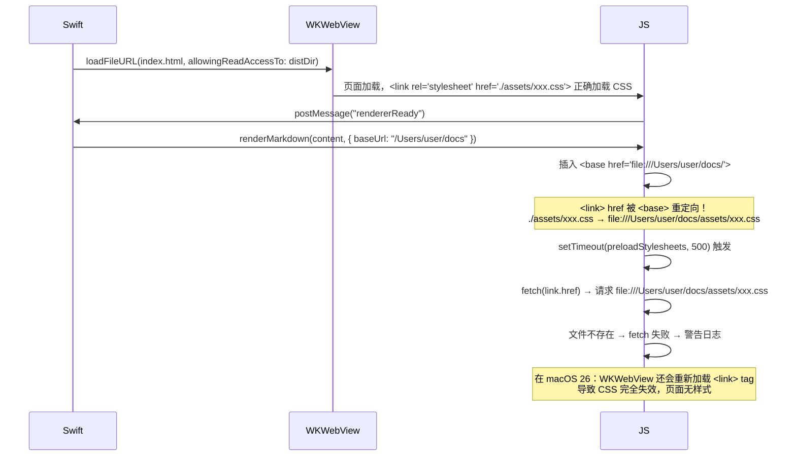

# Debug：Issue #19 — macOS 26 Tahoe CSS 样式丢失

## 问题描述

FluxMarkdown v1.22.275 在 **macOS 26 Tahoe** 上打开 Markdown 文件时，渲染结果无样式（CSS 未应用）。
日志中可见：

```
[com.markdownquicklook.app:MarkdownWebView] JS Log: Warning: Could not fetch stylesheet
file:///Users/<user>/assets/index-FYNksynM.css: TypeError: Load failed
```

相关 Issue：[#19](https://github.com/xykong/flux-markdown/issues/19)

---

## 根因分析

### Bug 1：Sandbox Extension 失败（macOS 26）

与 Issue #13 同根因：app 以 ad-hoc 方式签名（`TeamIdentifier=not set`）。
macOS 26 Tahoe 收紧了 sandbox 策略，`WebContent` 进程无法为 `~/Downloads` 以外的文件创建 sandbox extension。

**症状** ：文件无法被预览，仅显示 WelcomeView。
**范围** ：仅影响 macOS 26 Tahoe，需更新 entitlements 或使用 Developer ID 签名解决。

### Bug 2：CSS 路径被 `<base>` 标签重定向（所有版本）

这是 CSS 样式完全消失的直接原因，与 macOS 版本无关，只是在 macOS 26 更容易触发。

**调用链：**



**两个子问题：**

1. `renderMarkdown()` 在 `<base>` 插入之前没有固化 `<link>` 的 `href`，导致 `<base>` 改变了 stylesheet 的解析路径。

2. `preloadStylesheets()` 使用 `fetch(link.href)` 加载 CSS，而此时 `link.href` 已被 `<base>` 重定向到错误路径。

---

## 修复方案

### Fix 1：插入 `<base>` 前固化所有 stylesheet href

**文件** ：`web-renderer/src/index.ts`，`renderMarkdown()` 函数

**变更** ：在设置 `<base href>` 之前，先把所有 `<link rel="stylesheet">` 的 `href` attribute 替换为当前解析后的绝对 URL。

`link.href`（DOM getter）始终返回绝对 URL；`setAttribute('href', link.href)` 将其写回 attribute，此后 `<base>` 的改变不再影响该链接的解析结果。

```typescript
if (options.baseUrl) {
    document.querySelectorAll<HTMLLinkElement>('link[rel="stylesheet"]').forEach(link => {
        link.setAttribute('href', link.href);
    });

    let existingBase = document.querySelector('base');
    // ... 后续 base 插入逻辑不变
}
```

### Fix 2：用 `cssRules` 替换 `preloadStylesheets` 中的 `fetch()`

**文件** ：`web-renderer/src/index.ts`，`preloadStylesheets()` 函数

CSS 文件在页面初始加载时已经通过 `<link>` 标签被浏览器解析并缓存在 `document.styleSheets` 中。
无需再通过 `fetch()` 重新请求文件，直接读取 `cssRules` 即可，既无 I/O 开销，也不受 `<base>` 影响。

旧实现（有问题）：

```typescript
async function preloadStylesheets() {
    const links = document.querySelectorAll<HTMLLinkElement>('link[rel="stylesheet"]');
    for (const link of Array.from(links)) {
        const response = await fetch(link.href); // link.href 已被 <base> 污染
        cachedCssText += await response.text();
    }
}
```

新实现（修复后）：

```typescript
function collectStylesheetRules(): string {
    let css = '';
    for (const sheet of Array.from(document.styleSheets)) {
        try {
            if (sheet.cssRules) {
                for (const rule of Array.from(sheet.cssRules)) {
                    if (!css.includes(rule.cssText)) {
                        css += rule.cssText + '\n';
                    }
                }
            }
        } catch (_e) {}
    }
    return css;
}
```

同时将 `exportHTML()` 中重复的 `cssRules` 遍历逻辑提取为 `collectStylesheetRules()`，消除重复。

---

## TDD 过程

按照 Red-Green-Refactor 流程修复：

| 阶段 | 测试文件 | 说明 |
|------|----------|------|
| 🔴 RED | `test/base-tag-css.test.ts` | 确认 `link.href` 在 `<base>` 插入后被污染 |
| 🔴 RED | `test/preload-stylesheets.test.ts` | 确认 `fetch()` 被调用且 URL 指向用户目录 |
| 🟢 GREEN | `src/index.ts` Fix 1 | 插入 `<base>` 前固化 href |
| 🟢 GREEN | `src/index.ts` Fix 2 | 用 `cssRules` 替换 `fetch()` |
| 🔵 REFACTOR | `src/index.ts` | 提取 `collectStylesheetRules()`，消除重复 |

最终：126/126 测试通过，0 回归。

---

## 遗留问题

**Bug 1（Sandbox Extension 失败）** 未在此次修复中解决。该问题需要：

- 申请 Apple Developer ID 证书并正式签名
- 或在 entitlements 中添加 `com.apple.security.temporary-exception.files.absolute-path.read-only`（路径 `/`）

此为 macOS 26 Tahoe 特有的策略收紧，影响所有 ad-hoc 签名的 app。

---

## 相关文件

- `web-renderer/src/index.ts` — 主要修复位置
- `web-renderer/test/base-tag-css.test.ts` — Bug 1 测试
- `web-renderer/test/preload-stylesheets.test.ts` — Bug 2 测试
- `Sources/MarkdownPreview/PreviewViewController.swift` — `baseUrl` 传入逻辑（未修改）
