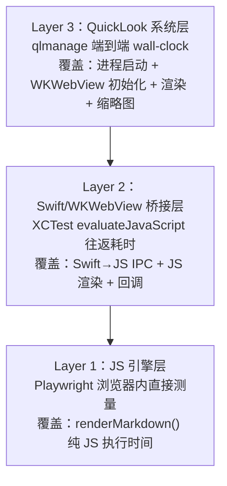

# 性能基线测试报告

**测试日期** ：2026-02-21
**版本** ：1.14.164
**平台** ：macOS / Apple Silicon (arm64)

---

## 概述

本文档记录了 FluxMarkdown 在优化前的渲染性能基线数据。测试分为三个层次，分别覆盖 JS 引擎层、Swift/WKWebView 桥接层、以及 QuickLook 系统层，用于后续优化效果的量化对比。

所有测试均使用固定的 7 个 Markdown fixture 文件，区分 **冷启动** （Cold）和 **热启动** （Warm）两种场景。

---

## 测试架构



| 层次 | 测试工具 | 覆盖范围 | 迭代次数 |
|---|---|---|---|
| Layer 1 | Playwright (Node.js) | JS 渲染引擎（markdown-it + highlight.js + mermaid + KaTeX） | 20 次 |
| Layer 2 | XCTest (Swift) | WKWebView 桥接 + JS 完整往返 | 10 次 |
| Layer 3 | qlmanage | QuickLook 端到端系统调用 | 20 次 |

---

## Fixture 文件说明

| 文件 | 大小 | 主要特征 |
|---|---|---|
| `01-tiny.md` | 0.3 KB | 极小文件，隔离冷启动开销 |
| `02-small-gfm.md` | 3.2 KB | GFM 特性（表格、任务列表等） |
| `03-medium-code.md` | 17.6 KB | 多语言代码块，考验 highlight.js |
| `04-large-prose.md` | 16.2 KB | 大量纯文本段落，考验 DOM 规模 |
| `05-mermaid.md` | 7.1 KB | 8 个 Mermaid 图表 |
| `06-katex.md` | 4.0 KB | KaTeX 数学公式 |
| `07-mixed.md` | 11.2 KB | 综合：代码 + Mermaid + KaTeX |

---

## Layer 1 — JS 引擎层基线

> 指标：`renderMarkdown()` 在 Playwright 浏览器内的完整执行耗时（不含 WKWebView IPC 开销）。
> 冷启动 = 全新 JS 上下文（无任何缓存），热启动 = 同一页面复用渲染。

| Fixture | 冷启动 p50 | 冷启动 p95 | 热启动 p50 | 热启动 p95 | Mermaid 图表数 |
|---|---|---|---|---|---|
| 01-tiny.md | 19.3 ms | 19.6 ms | 0.4 ms | 0.6 ms | 0 |
| 02-small-gfm.md | 30.9 ms | 31.1 ms | 1.2 ms | 1.5 ms | 0 |
| 03-medium-code.md | 72.0 ms | 73.0 ms | 6.9 ms | 7.5 ms | 0 |
| 04-large-prose.md | 29.3 ms | 29.7 ms | 2.3 ms | 2.7 ms | 0 |
| **05-mermaid.md** | **331.4 ms** | **339.1 ms** | **184.2 ms** | **209.7 ms** | 8 |
| 06-katex.md | 40.4 ms | 40.7 ms | 12.4 ms | 15.6 ms | 0 |
| 07-mixed.md | 160.3 ms | 162.3 ms | 44.0 ms | 45.3 ms | 2 |

**结论** ：
- 非 Mermaid 文件的热启动渲染极快（<10 ms），JS 引擎本身性能良好。
- Mermaid 是最大瓶颈：冷启动 331 ms，热启动仍需 184 ms（每次调用均重新 `initialize()`）。
- 冷启动约 19–72 ms 的耗时主要来自 JS 模块初始化（highlight.js 全量加载 ~400 KB）。

---

## Layer 2 — Swift/WKWebView 桥接层基线

> 指标：`evaluateJavaScript(renderMarkdown)` 从 Swift 发起到收到回调的完整往返耗时（含 IPC、JS 执行、消息回传）。
> 冷启动 = 每次新建 WKWebView 实例，热启动 = 同一 WKWebView 复用。

| Fixture | 冷启动 p50 | 冷启动 p95 | 热启动 p50 | 热启动 p95 |
|---|---|---|---|---|
| 01-tiny.md | 8 ms | 10 ms | 0 ms | 1 ms |
| 02-small-gfm.md | 20 ms | 20 ms | 4 ms | 4 ms |
| 03-medium-code.md | 49 ms | 50 ms | 14 ms | 15 ms |
| 04-large-prose.md | 29 ms | 29 ms | 14 ms | 14 ms |
| **05-mermaid.md** | **378 ms** | **398 ms** | **233 ms** | **243 ms** |
| 06-katex.md | 30 ms | 31 ms | 13 ms | 14 ms |
| 07-mixed.md | 170 ms | 170 ms | 63 ms | 67 ms |

**结论** ：
- 相比 Layer 1，热启动各文件额外增加约 3–13 ms 的 Swift↔JS IPC 开销（桥接序列化）。
- Mermaid 冷启动增至 378 ms，表明每次新建 WKWebView 时，mermaid 初始化成本更高。
- `07-mixed.md` 热启动 63 ms vs Layer 1 的 44 ms，差值 ~19 ms 为 IPC 往返开销。

---

## Layer 3 — QuickLook 系统层基线

> 指标：`qlmanage -t` 端到端 wall-clock 时间，包含：进程 spawn、extension 加载、WKWebView 初始化、5.5 MB HTML 解析、JS 渲染、缩略图生成。
> 冷启动 = `qlmanage -r` 清空缓存后测量，热启动 = 不清缓存连续测量。

| Fixture | 冷启动 p50 | 冷启动 p95 | 热启动 p50 | 热启动 p95 |
|---|---|---|---|---|
| 01-tiny.md | 205 ms | 235 ms | 206 ms | 225 ms |
| 02-small-gfm.md | 218 ms | 253 ms | 221 ms | 245 ms |
| 03-medium-code.md | 239 ms | 267 ms | 234 ms | 272 ms |
| 04-large-prose.md | 228 ms | 249 ms | 227 ms | 240 ms |
| 05-mermaid.md | 248 ms | 275 ms | 242 ms | 258 ms |
| 06-katex.md | 245 ms | 272 ms | 227 ms | 257 ms |
| **07-mixed.md** | **265 ms** | **289 ms** | **243 ms** | **281 ms** |

**结论** ：
- **~200 ms 是用户感知的固定延迟下限** ，由进程启动 + WKWebView 初始化 + 5.5 MB 单文件 HTML 解析决定，与文件内容几乎无关。
- 冷热启动差异极小（<20 ms），说明 QuickLook extension 进程池机制基本消除了热启动优势。
- Mermaid 的 184–233 ms JS 渲染耗时被掩盖在 ~200 ms 固定开销中，但当 `qlmanage` 超时截断时，复杂 Mermaid 图表可能无法完整渲染。

---

## 瓶颈归因分析


### 优先级排序的优化机会

| 优先级 | 瓶颈 | 当前耗时 | 优化方案 |
|---|---|---|---|
| P0 | 5.5 MB 单文件 HTML | ~120 ms 解析 | 拆分 bundle，启用 `LocalSchemeHandler` |
| P1 | highlight.js 全量引入 (~400 KB) | 15–70 ms (冷) | 按需加载语言包 |
| P2 | Mermaid 每次 re-initialize | 184–233 ms (热) | 缓存 mermaid 实例 |
| P3 | `collectImageData()` 阻塞主线程 | 变化 | 移至后台线程 |
| P4 | JS 中 base64→blob URL 二次转换 | 小 | 激活已有的 `LocalSchemeHandler` |

---

## 测试数据文件

所有原始数据均已版本控制，保存于：

```
benchmark/results/
├── js-bench-2026-02-21_12-46-46.json   # Layer 1 原始数据
├── js-bench-latest.json                 # Layer 1 最新
├── swift-bench-2026-02-21_20-55-51.json # Layer 2 原始数据
├── swift-bench-latest.json              # Layer 2 最新
├── ql-bench-2026-02-21_20-59-10.json   # Layer 3 原始数据
└── ql-bench-latest.json                 # Layer 3 最新
```

使用 `benchmark/compare.py` 可在优化后与本基线进行对比：

```bash
python3 benchmark/compare.py \
  benchmark/results/js-bench-latest.json \
  benchmark/results/js-bench-<优化后>.json
```
