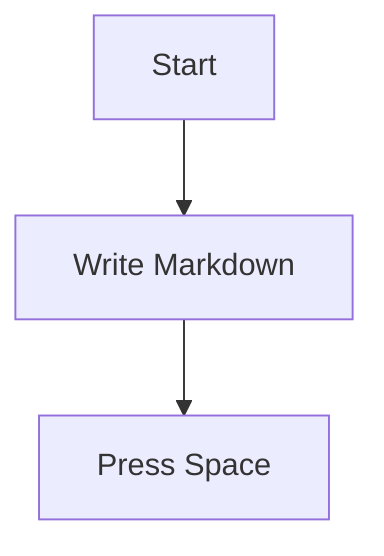

# FluxMarkdown 使用指南（新手友好）

这份文档面向 **普通用户**：帮你在 1 分钟内完成第一次成功预览，并在遇到问题时按“由浅入深”的顺序排查。

> 如果你是开发者/想看更底层的原理与命令行诊断，请直接跳到：
> - 高级排障：[`TROUBLESHOOTING.md`](TROUBLESHOOTING.md)

---

## 1) 先体验一次“它真的在工作”

1. 在 Finder 里找到一个 `.md` 文件
2. 选中它，按 **Space（空格）**
3. 你应该看到带样式的 Markdown 预览（而不是纯文本）

如果这一步成功了，后面只是可选增强。

---

## 2) 第一次使用（推荐流程）

### Step A：启动一次 App（很重要）

macOS 的 QuickLook 扩展通常需要宿主 App 被打开过一次，系统才会完成注册。

1. 打开 **Applications（应用程序）**
2. 启动 **FluxMarkdown** 一次
3. 出现欢迎窗口即可（不需要选择文件）

### Step B：确认 Quick Look 扩展已启用

如果你按空格仍然是旧预览：

1. 打开 **System Settings（系统设置）**
2. 进入 **Extensions（扩展）** → **Quick Look（快速查看）**
3. 确认 **FluxMarkdown / MarkdownPreview** 相关项已启用

---

## 3) 常见问题（由简到难）

### 3.1 按空格还是“没有变化”

按下面顺序逐项尝试：

1. **重启 Finder**：在 Dock 上右键 Finder 图标（按住 Option 更稳妥）→ Relauch（重新启动）
2. **清理 QuickLook 缓存**：打开“终端”，运行：

```bash
qlmanage -r
qlmanage -r cache
killall Finder
```

然后回到 Finder 再按一次空格。

### 3.2 “App is damaged / 无法验证开发者”

这是 macOS 的安全机制（下载的 App 带有隔离标记）导致的。

打开终端运行：

```bash
xattr -cr "/Applications/FluxMarkdown.app"
```

再重新打开 App。

### 3.3 预览能打开，但偶尔显示成纯文本

通常是系统选择了其他 QuickLook 插件或缓存。

1. 先按 **3.1** 的步骤清理缓存
2. 确认 FluxMarkdown 是 `.md` 的默认打开方式（可选）：右键文件 → Get Info → Open with

如果仍不稳定，请看高级排障：[`TROUBLESHOOTING.md`](TROUBLESHOOTING.md)

---

## 4) 如何使用 App（打开文件 / 拖拽 / 设置）

### 打开文件

- 方式 1：双击 `.md` 文件（若 FluxMarkdown 是默认打开方式）
- 方式 2：在欢迎窗口点击中间的 **+**，选择文件
- 方式 3：把文件直接拖到欢迎窗口的 **+** 区域

### 打开设置（Settings）

- 快捷键：**Cmd + ,**
- 或者在欢迎窗口点击 **Open Settings**

---

## 5) 小贴士：如何写出“预览效果更好”的 Markdown

FluxMarkdown 支持 Mermaid、KaTeX、GFM 等。这里给你几个可复制粘贴的小示例：

### Mermaid



### KaTeX

行内：`$E = mc^2$`

块级：

```tex
\int_a^b f(x)\,dx
```

---

## 6) 仍然需要帮助？

1. 先看高级排障（包含更详细的检查命令与原因解释）：[`TROUBLESHOOTING.md`](TROUBLESHOOTING.md)
2. 如果你愿意反馈问题：
   - GitHub Issues：<https://github.com/xykong/flux-markdown/issues>
