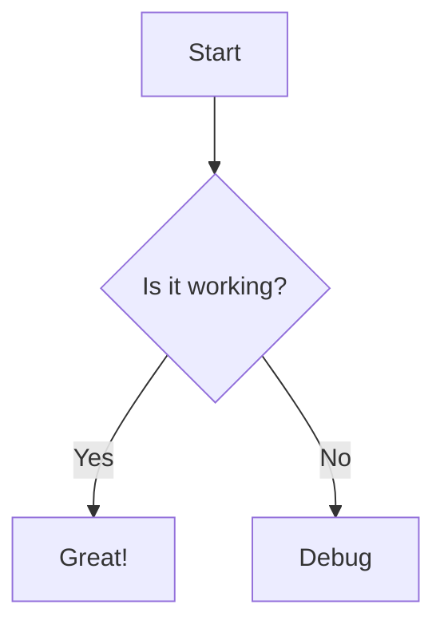

# Markdown Quick Look Test

## Basic Markdown
**Bold**, *Italic*, ~~Strikethrough~~

## Code Block
```javascript
const hello = () => {
  console.log("Hello, World!");
};
```

## Math (KaTeX)
Inline: $E=mc^2$

Block:
$$
\frac{-b \pm \sqrt{b^2 - 4ac}}{2a}
$$

## Mermaid Diagram


## Task List
- [x] Build project
- [x] Run tests
- [ ] Deploy

## Table
| Feature | Status |
|---------|--------|
| Markdown | ✅ |
| Code Highlight | ✅ |
| Math | ✅ |
| Mermaid | ✅ |
